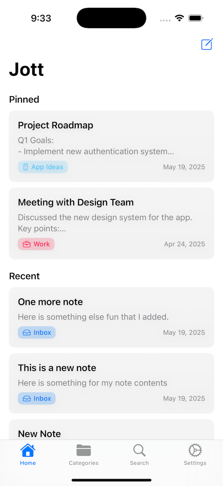
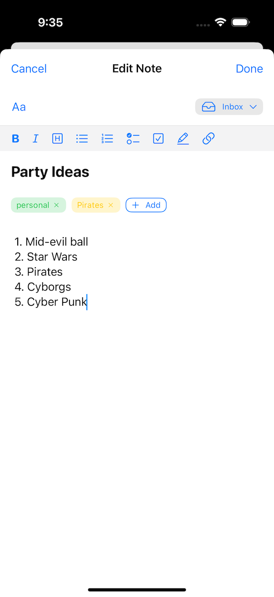
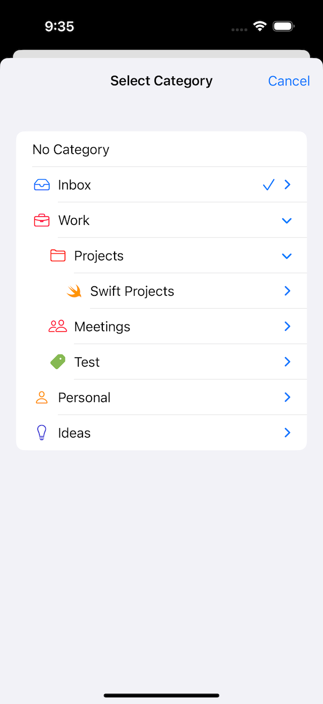
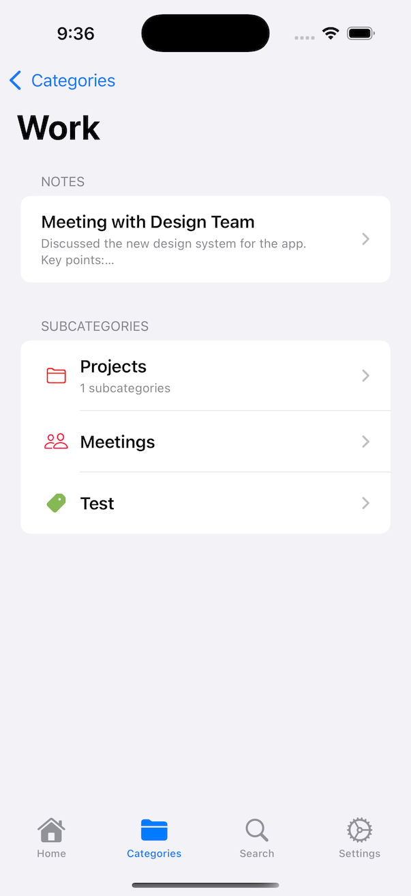
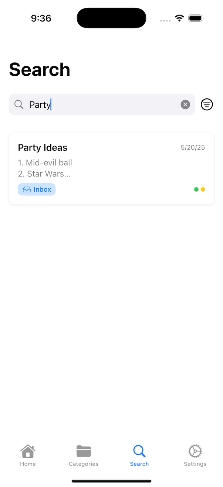
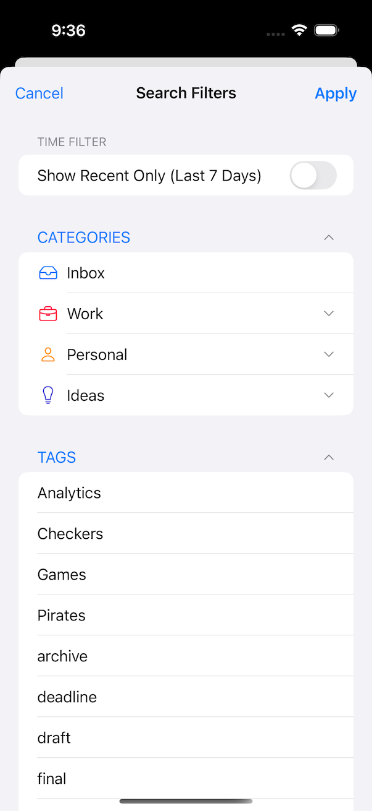
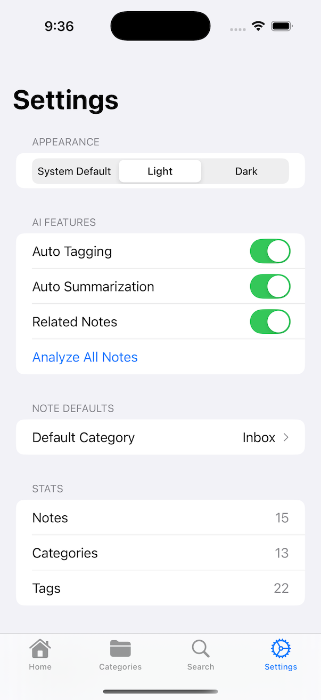

# Jott - A Smart Note Organizer

A modern note-taking application leveraging Apple's ML and language processing capabilities to automatically organize and enhance your notes.

## Features

- **Intelligent Note Organization**: Automatic categorization and tagging of notes based on content analysis
- **Smart Content Analysis**: Real-time text analysis using Natural Language framework
- **Content Summarization**: AI-powered summarization of longer notes for quick review
- **Advanced Search**: Find notes quickly with powerful search capabilities
- **Tag Management**: Smart tagging system that suggests and applies relevant tags
- **Category Organization**: Automatically categorize notes into customizable folders
- **Sleek SwiftUI Interface**: Modern, intuitive user interface built with SwiftUI
- **Persistent Storage**: Reliable data storage using SwiftData
- **Cross-Device Sync**: Keep your notes in sync across all your Apple devices with CloudKit (coming soon)
- **OCR Functionality**: Extract text from images of documents or handwritten notes (coming soon)

## Technologies Used

- **SwiftUI**: Modern declarative UI framework for building the user interface
- **SwiftData**: Apple's latest persistence framework for data storage
- **CoreML**: Machine learning framework to power intelligent features
- **Natural Language**: Advanced text processing and analysis
- **Dependency Injection**: Custom DI system for clean architecture and testability
- **Swift Concurrency**: Modern async/await pattern for smooth performance
- **Vision**: Image analysis and processing capabilities (planned for OCR)
- **CloudKit**: Apple's cloud database service for sync capabilities (planned)

## System Requirements

- iOS 17.0+
- iPadOS 17.0+
- macOS 14.0+ (Sonoma)
- watchOS 10.0+
- Xcode 15.0+
- Swift 6.0

## Installation

1. Clone the repository:
```bash
git clone https://github.com/cshireman/jott.git
```

2. Open the project in Xcode:
```bash
cd jott
open Jott.xcodeproj
```

3. Select your target device and click Run.

## Usage

### Creating Notes

1. Tap the "+" button in the Notes tab to create a new note
2. Enter a title and content for your note
3. Save the note to see automatic categorization and tag suggestions

### Managing Categories and Tags

1. Navigate to the Categories or Tags tab to view and manage your organization system
2. Add, edit, or delete categories and tags as needed
3. The app will learn from your organizational choices to improve future suggestions

### Searching Content

1. Use the search bar to quickly find notes based on content, title, tags, or categories
2. Advanced filtering options are available through the filter menu

## Demo Video

<!-- {"width":371} -->

## Screenshots

<!-- {"width":261} -->
<!-- {"width":261} -->
<!-- {"width":261} -->
<!-- {"width":261} -->
<!-- {"width":261} -->
<!-- {"width":261} -->
<!-- {"width":261} -->

## Architecture

Smart Note Organizer follows a clean architecture approach with the following components:

- **Models**: SwiftData models for notes, categories, tags, and attachments
- **Repositories**: Data access layer for SwiftData operations
- **Services**: Business logic and integration with Apple frameworks
- **ViewModels**: Presentation logic and state management
- **Views**: SwiftUI interface components

The app uses a custom dependency injection system to maintain loose coupling between components, making the codebase more maintainable and testable.

## Future Enhancements

- OCR functionality for scanning documents and handwritten notes
- CloudKit integration for cross-device synchronization
- Enhanced ML capabilities for better content understanding
- Collaboration features for shared notes
- More customization options for the UI
- Apple Watch companion app

## Contributing

Contributions are welcome! Please feel free to submit a Pull Request.

## License

This project is licensed under the MIT License - see the LICENSE file for details.

## Contact

Chris Shireman - [GitHub](https://github.com/cshireman)

Project Link: [https://github.com/cshireman/jott](https://github.com/cshireman/jott)
